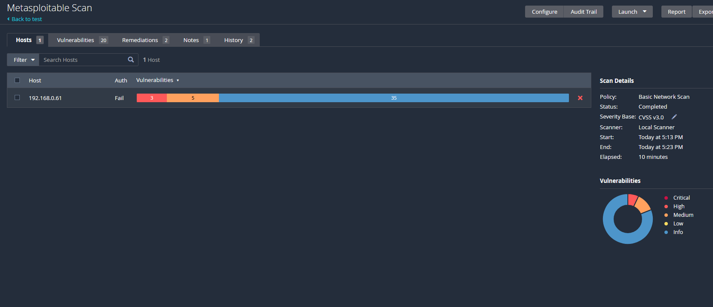
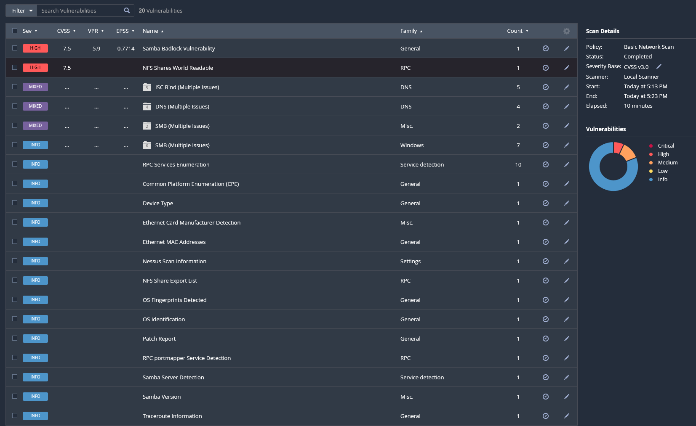
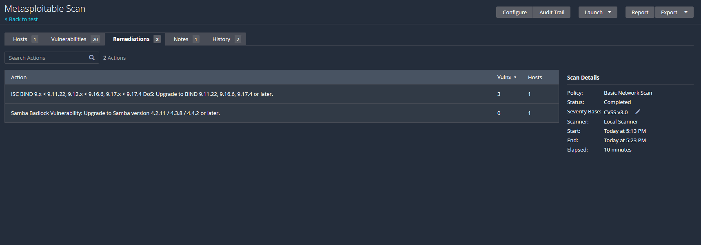

# Nessus Vulnerability Assessment

## Overview

A vulnerability assessment was conducted using Nessus Essentials against a Metasploitable 2 virtual machine to simulate a real-world enterprise security evaluation.

## Scan Details

* Tool: Nessus Essentials
* Target: Metasploitable 2
* Scan Type: Basic Network Scan
* Scanner: Local Scanner

## Results Summary

* Critical: 3
* High: 5
* Medium: Multiple
* Informational: 35

## Key Findings

### 1. Samba Badlock Vulnerability

* Severity: High
* CVSS Score: 7.5
* Risk: Potential for man-in-the-middle attacks and credential compromise
* Recommendation: Upgrade Samba to a secure version

### 2. NFS Shares World Readable

* Severity: High
* Risk: Unauthorized access to sensitive data
* Recommendation: Restrict NFS permissions

### 3. DNS / BIND Multiple Vulnerabilities

* Severity: Medium–High
* Risk: Denial of Service and system instability
* Recommendation: Upgrade BIND to a secure version

## Remediation Summary

* Apply security patches to outdated services
* Restrict unnecessary network access
* Harden system configurations

## Notes

The scan was conducted in a controlled lab environment. Some plugin updates were pending, which may affect the completeness of results.

## Screenshots

### Scan Summary

### Vulnerabilities

### Remediations

